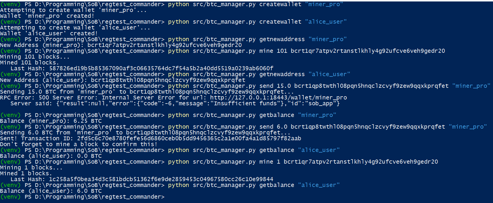

# Bitcoin Regtest Commander ⚡


A robust CLI tool for managing a local **Bitcoin Regtest** network. This project demonstrates a decoupled architecture where Python logic interacts with a Dockerized Bitcoin Core node via JSON-RPC, automating complex workflows like wallet management, block generation, and transaction signing.

---

## 🚀 Features at a Glance

* **Docker Integration:** Seamlessly connects to a headless `bitcoind` container.
* **Automated Lifecycle:** Handles the "Coinbase Maturity" rule (100 blocks) automatically.
* **Multi-Wallet Support:** Routes RPC commands to specific wallet endpoints (`/wallet/<name>`).
* **Safety Mechanisms:** Includes fee estimation fallbacks and explicit confirmation warnings.
* **Clean Architecture:** Uses a virtual environment and `argparse` for professional CLI handling.

---

## 🛠️ Network Setup

This tool requires a local Bitcoin Core node running in **Regression Test Mode**. I utilize Docker to ensure a clean, reproducible environment.

### 1. Start the Bitcoin Node
Run the following command to spin up the container with the necessary RPC ports exposed and fallback fees enabled (crucial for Regtest):

```bash
docker run -d --name bitcoind-regtest \
  -v bitcoin-regtest-data:/home/bitcoin/.bitcoin \
  -p 127.0.0.1:18443:18443 \
  bitcoin/bitcoin \
  -printtoconsole \
  -regtest=1 \
  -server=1 \
  -rpcbind=0.0.0.0 \
  -rpcallowip=172.17.0.0/16 \
  -rpcuser=bitcoinrpc \
  -rpcpassword=bitcoinrpcpassword \
  -fallbackfee=0.00001
```

### 2. Install Dependencies
This project uses a virtual environment to manage RPC libraries.

```bash
# Windows
python -m venv venv
.\venv\Scripts\activate
pip install -r requirements.txt
```

---

## 📸 Proof of Work (Demo)

The following screenshot demonstrates a full transaction lifecycle:
1.  **Creation:** Miner wallet initialized.
2.  **Funding:** 101 blocks mined to unlock coinbase rewards.
3.  **Transfer:** Sending coins to a user (`alice_user`).
4.  **Verification:** Confirming the transaction on the ledger.



> *Note: The tool handles the logic for ensuring funds are spendable by validating block depth before attempting transactions.*

---

## 📚 Command Documentation

The CLI is built with `argparse` for robust input validation. Run `python src/btc_manager.py --help` for the full menu.

| Command | Usage | Description |
| :--- | :--- | :--- |
| **`getinfo`** | `python src/btc_manager.py getinfo` | Fetches current block height, difficulty, and chain status from the Docker node. |
| **`createwallet`** | `... createwallet <name>` | Idempotent command that creates a new wallet or loads it if it already exists (handling `Database Already Loaded` errors). |
| **`getnewaddress`** | `... getnewaddress <wallet>` | Generates a Bech32 address for the specified wallet. Uses RPC routing `/wallet/<name>`. |
| **`mine`** | `... mine <n> <addr>` | Generates `n` blocks to the specified address. Useful for maturing coinbase rewards (needs 100+ blocks). |
| **`send`** | `... send <amt> <addr> <wallet>` | Creates and broadcasts a transaction. **Note:** Does not confirm it automatically; use `mine 1` afterwards. |
| **`getbalance`** | `... getbalance <wallet>` | Checks the confirmed spendable balance of a specific wallet. |

---

## 🧠 Technical Highlights

### RPC Routing & Architecture
Standard Bitcoin RPC calls go to `http://localhost:18443/`. However, for multi-wallet operations, requests must be routed to `http://localhost:18443/wallet/<wallet_name>`.
This tool implements a dynamic wrapper that automatically switches endpoints based on the command context.

### Transaction Logic
The tool abstracts the complexity of:
1.  **UTXO Selection:** Delegated to the node's wallet manager.
2.  **Signing:** Performed automatically by the node's keystore.
3.  **Fee Estimation:** Configured with a fallback rate (`0.00001 BTC/kvB`) to prevent "Fee Estimation Failed" errors common on empty Regtest chains.

---

## 📄 License
This project is open source and available for the Summer of Bitcoin community.
